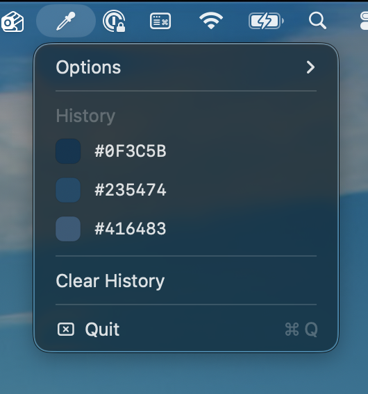
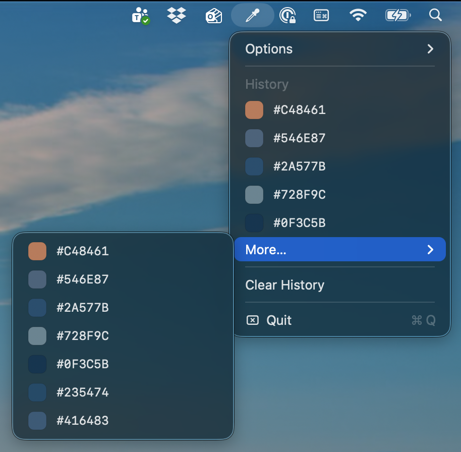

# vaelja

> *from Swedish — välja: to choose, to pick.*

The minimal, PowerToys-inspired color picker that macOS deserves. Simple UI, copies directly to your clipboard.


## Install

```sh
brew tap 0xff4b/vaelja
brew install vaelja
```

or

```sh
brew install 0xff4b/vaelja/vaelja
```

> **Note:** On first launch macOS may block the app. Go to **System Settings → Privacy & Security** and click **"Open Anyway"** — this is a one-time step.

## Usage

- Press **⌥⇧C** (default) to pick a color from anywhere on screen
- The hex code is copied to your clipboard automatically
- Access color history and change the shortcut from the menu bar icon

<div style="display: flex; gap: 8px;">
  
  
</div>

## Requirements

macOS Ventura or later

## License

MIT
